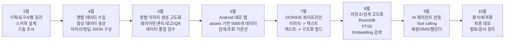
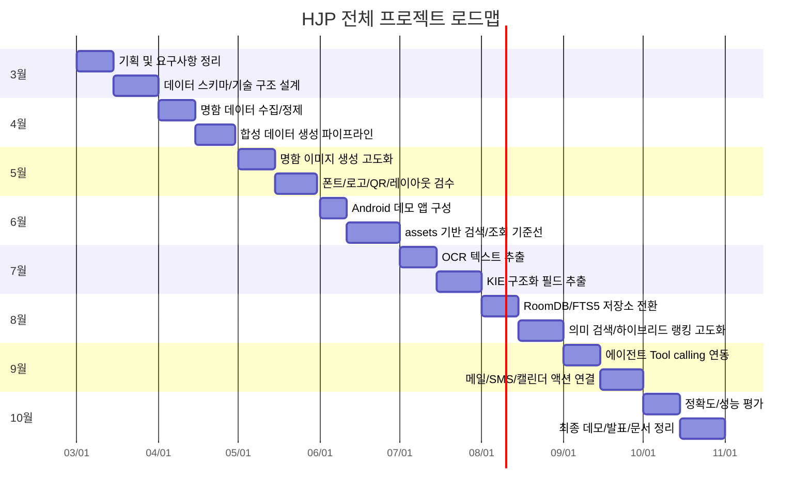

# HJP 전체 프로젝트 마일스톤

프로젝트 기간: 2026년 3월 ~ 2026년 10월

이 문서는 검색/조회 파트만이 아니라 전체 프로젝트 흐름을 기준으로 정리한 마일스톤입니다.

## 전체 흐름도

GitHub Markdown에서는 아래 Mermaid 코드가 다이어그램으로 렌더링됩니다.



## 월별 타임라인



## 단계별 정리

| 기간 | 단계 | 목표 | 주요 산출물 |
| --- | --- | --- | --- |
| 3월 | M1. 기획/설계 | 전체 기능 범위와 데이터 구조 확정 | 요구사항, 명함 스키마, 기술 구조 초안 |
| 4월 | M2. 데이터 수집/생성 | 명함 데이터셋 구축 | 명함 이미지, 정답 JSON, 비식별화 기준 |
| 5월 | M3. 이미지 생성 고도화 | 다양한 명함 이미지 품질 확보 | 레이아웃, 폰트, 로고, QR, 품질 검수 결과 |
| 6월 | M4. Android 데모/검색 기준선 | 5000개 assets 기반 검색/조회 데모 | Android 앱, JSON 데이터, 이미지, 사전 계산 벡터 |
| 7월 | M5. OCR/KIE | 명함 이미지에서 구조화 정보 추출 | OCR 결과, 이름/회사/직책/연락처 필드 |
| 8월 | M6. 저장소/검색 고도화 | 실제 앱 저장소와 검색 품질 개선 | RoomDB, FTS5, embedding table, 하이브리드 랭킹 |
| 9월 | M7. AI 에이전트 연동 | 자연어 요청을 도구 호출과 외부 액션으로 연결 | search/get detail/email/sms/calendar tools |
| 10월 | M8. 평가/최종화 | 정확도, 속도, 메모리 검증 및 발표 준비 | 평가 결과, 최종 APK, README, 발표자료 |

## 주요 개발 축

```text
데이터
  명함 이미지 수집/생성
  정답 JSON 구축
  비식별화/품질 검수

OCR/KIE
  이미지 -> 텍스트
  텍스트 -> 이름/회사/직책/연락처/주소 필드

저장소
  초기 데모: APK assets
  제품화 방향: RoomDB + FTS5 + embedding table

검색/조회
  키워드 검색
  의미기반 검색
  하이브리드 랭킹
  cardId 기반 상세 조회

에이전트
  자연어 요청 해석
  search/get detail tool call
  메일/SMS/캘린더 외부 앱 연동

평가
  OCR 정확도
  검색 top-k 정확도
  latency
  메모리 사용량
  오프라인 동작
```

## 현재 위치

현재 구현은 6월 단계인 `M4. Android 데모/검색 기준선`에 해당합니다.

```text
5000개 assets 데이터
명함 이미지 assets 저장
business_cards.json 기반 메타데이터 로딩
사전 계산 벡터 파일 로딩
키워드 contains 검색
EmbeddingGemma/LocalEmbedding 기반 의미 점수
키워드 + 의미 점수 weighted sum
cardId 기반 상세 조회
```

## 이후 우선순위

1. OCR/KIE 파이프라인 연결
2. OCR/KIE 결과를 BusinessCard 스키마로 정규화
3. assets 구조를 RoomDB/FTS5 구조로 전환
4. 검색 평가용 query set 작성
5. 하이브리드 점수 정규화 및 rerank 정책 검토
6. 에이전트 tool call과 외부 앱 액션 연결
7. 최종 정확도/성능 평가 및 발표 문서 정리
