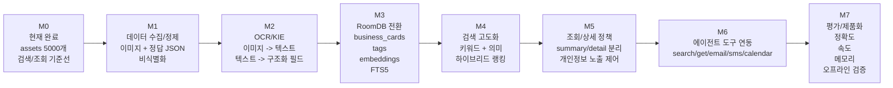
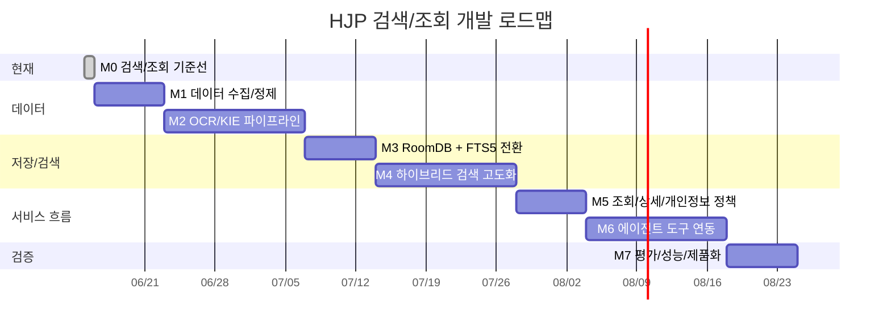

# HJP 검색/조회 마일스톤

기준일: 2026.06.15

목표는 명함 이미지 수집부터 OCR/KIE, 저장소 전환, 하이브리드 검색, 상세 조회, 에이전트 액션까지 이어지는 온디바이스 명함 관리 흐름을 완성하는 것입니다.

## 전체 흐름

GitHub Markdown에서는 아래 Mermaid 코드가 그림으로 렌더링됩니다.



## 타임라인

아래 일정은 확정 날짜가 아니라 개발 계획을 설명하기 위한 예상 기간입니다.



## 단계별 산출물

| 단계 | 예상 기간 | 목표 | 주요 산출물 |
| --- | ---: | --- | --- |
| M0. 검색/조회 기준선 | 완료 | 현재 데모 검색 구조 정리 | assets 데이터, 사전 계산 벡터, 하이브리드 검색 |
| M1. 데이터 수집/정제 | 1주 | 명함 데이터셋 구축 | 명함 이미지, 정답 JSON, 비식별화 기준 |
| M2. OCR/KIE | 2주 | 이미지에서 구조화 필드 추출 | OCR 결과, 이름/회사/직책/연락처 필드 |
| M3. 저장소 전환 | 1주 | assets를 실제 앱 저장소로 전환 | RoomDB, FTS5, embedding table |
| M4. 검색 고도화 | 2주 | 키워드 + 의미기반 검색 품질 개선 | FTS5 검색, EmbeddingGemma, score fusion |
| M5. 조회/상세 정책 | 1주 | 검색 결과와 상세 조회 분리 | get_card_detail, 개인정보 노출 정책 |
| M6. 에이전트 연동 | 2주 | 자연어 요청을 도구 호출로 연결 | search/get/email/sms/calendar tools |
| M7. 평가/제품화 | 1주 | 정확도, 속도, 메모리 검증 | top-k 평가, latency, 오프라인 검증 |

## 현재 위치

현재 구현은 M0에 해당합니다.

```text
5000개 assets 데이터
키워드 contains 검색
EmbeddingGemma/LocalEmbedding 기반 의미 점수
키워드 + 의미 점수 weighted sum
cardId 기반 상세 조회
```

## 다음 우선순위

1. 데이터 수집/정제 기준 확정
2. OCR/KIE 결과 스키마 확정
3. RoomDB entity와 FTS5 테이블 설계
4. 검색 평가용 query set 작성
5. 하이브리드 score 정규화와 rerank 정책 검토
